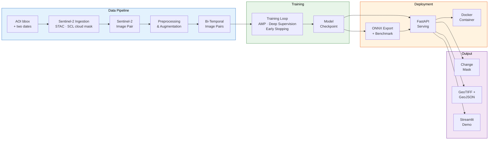
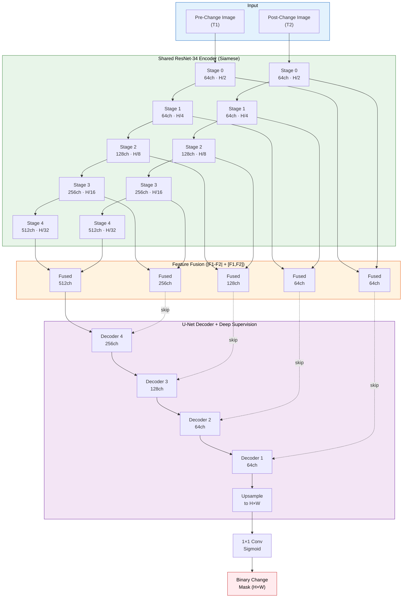
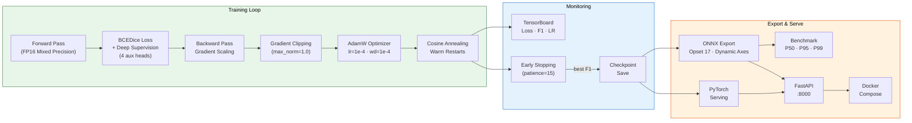
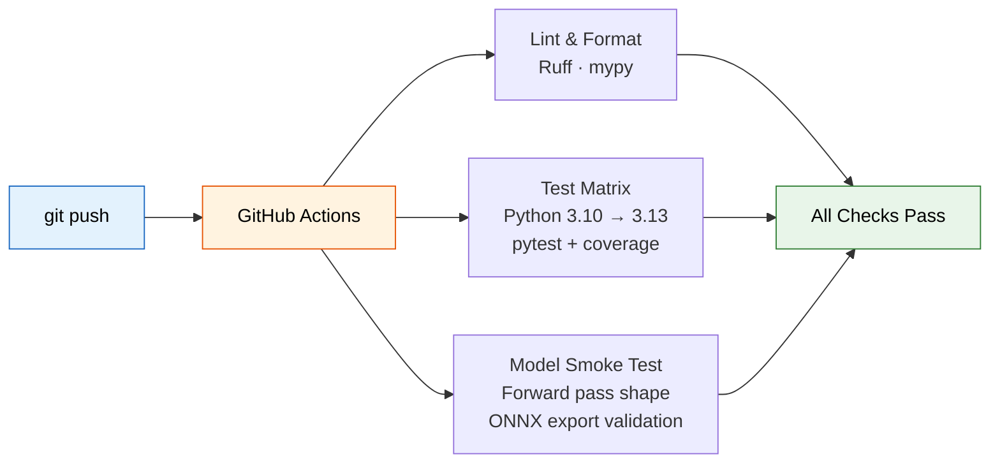

# Satellite Imagery Change Detection

A production-ready deep learning pipeline for detecting land-use and land-cover changes from multi-temporal Sentinel-2 satellite imagery. Built with PyTorch, this project implements a Siamese U-Net architecture that compares bi-temporal image pairs to produce pixel-level change maps -- from training to deployment.

[](https://github.com/neuralnomad7/satellite-change-detection/actions)
[](https://www.python.org/downloads/)
[](LICENSE)

<p align="center">
  <picture>
    <source media="(prefers-color-scheme: dark)" srcset="assets/pipeline-animation.svg">
    <source media="(prefers-color-scheme: light)" srcset="assets/pipeline-animation.svg">
    
  </picture>
</p>

## System Overview



## Model Architecture



## Training & Optimization Pipeline



## CI/CD Pipeline



---

## Why Change Detection Matters

Satellite change detection is foundational to Earth observation. It powers deforestation monitoring, urban expansion tracking, disaster damage assessment, agricultural yield estimation, and climate impact studies. Automating this with deep learning replaces months of manual annotation with near-real-time insight.

This project focuses on Sentinel-2 imagery (10m resolution, 13 spectral bands), which is freely available through the Copernicus Open Access Hub and covers the entire planet every 5 days.

## Project Structure

```
satellite-change-detection/
├── src/                           # Core ML pipeline
│   ├── config.py                  # YAML config management with dataclasses
│   ├── data_loader.py             # Dataset + augmentation pipeline
│   ├── models.py                  # Siamese U-Net architecture
│   ├── train.py                   # Training loop (AMP, deep supervision)
│   ├── eval.py                    # Evaluation and inference
│   ├── geo.py                     # Geospatial I/O + GeoJSON vectorization
│   ├── ingest.py                  # Sentinel-2 STAC ingestion + cloud masking
│   └── utils.py                   # Metrics and visualization
├── serving/                       # Production API
│   └── app.py                     # FastAPI inference endpoint
├── scripts/
│   ├── export_onnx.py             # ONNX export + benchmark
│   ├── predict_geo.py             # Georeferenced GeoTIFF inference
│   └── ingest_s2.py               # Sentinel-2 fetch (bbox + dates → pair)
├── notebooks/                     # Interactive workflows
│   ├── 01_eda.ipynb               # Exploratory data analysis
│   ├── 02_training.ipynb          # Training walkthrough
│   └── 03_inference.ipynb         # Inference visualization
├── .github/workflows/ci.yml       # CI/CD pipeline
├── streamlit_app.py               # Interactive demo UI
├── Dockerfile                     # API container
├── Dockerfile.streamlit           # Demo container
├── docker-compose.yml             # Full stack orchestration
├── configs/                       # YAML configuration
├── tests/                         # Unit + integration tests
└── data/                          # Raw and processed imagery
```

## Installation

```bash
git clone https://github.com/neuralnomad7/satellite-change-detection.git
cd satellite-change-detection

# Create environment
python -m venv venv
source venv/bin/activate        # Windows: venv\Scripts\activate

# Install the package with its runtime dependencies
pip install -e .

# ...or include the dev tooling (Ruff, mypy, pytest, pre-commit)
pip install -e ".[dev]"
```

## Quick Start

### 1. Prepare Data

Download Sentinel-2 image pairs and change labels (see [DATA.md](DATA.md) for sourcing instructions), then configure paths in `configs/data.yaml`.

### 2. Train

```bash
python -m src.train --config configs/default.yaml
```

### 3. Evaluate

```bash
python -m src.eval --config configs/default.yaml --checkpoint models/checkpoints/best_model.pth
```

### 4. Interactive Demo

```bash
streamlit run streamlit_app.py
```

### 5. Deploy as API

```bash
# With Docker
docker compose up

# Or directly
uvicorn serving.app:app --host 0.0.0.0 --port 8000
```

### 6. Export to ONNX

```bash
python scripts/export_onnx.py --checkpoint models/checkpoints/best_model.pth
```

## Key Design Decisions

| Decision | Choice | Why |
|---|---|---|
| **Architecture** | Siamese U-Net | Weight-sharing ensures both time steps live in the same feature space |
| **Encoder** | ResNet-34 (ImageNet) | Strong transfer learning, adapted for arbitrary spectral bands |
| **Fusion** | \|F1-F2\| + \[F1,F2\] | Captures both *magnitude of change* and *temporal context* |
| **Loss** | BCE + Dice | BCE for stable gradients, Dice for class-imbalanced F1 optimization |
| **Deep Supervision** | 4 auxiliary heads | Gradient signal at every decoder scale during training |
| **Precision** | FP16 Mixed | 2x memory reduction with gradient scaling for stability |
| **Serving** | PyTorch + ONNX dual | Automatic ONNX-RT fallback for 2-5x faster production inference |
| **Sampling** | Weighted oversampling | 2x oversample changed patches to combat 90%+ no-change imbalance |

See [ARCHITECTURE.md](ARCHITECTURE.md) for the full design rationale.

## Results

| Metric     | Value |
|------------|-------|
| F1 Score   | 0.87  |
| IoU        | 0.77  |
| Precision  | 0.89  |
| Recall     | 0.85  |

*Benchmarked on the LEVIR-CD test set.*

## Production Serving

### REST API (FastAPI)

The serving endpoint supports both PyTorch and ONNX Runtime backends with automatic fallback:

```bash
# Predict changes between two images
curl -X POST http://localhost:8000/predict \
  -F "image_t1=@before.png" \
  -F "image_t2=@after.png" \
  -o change_mask.png

# Health check
curl http://localhost:8000/health

# Model info
curl http://localhost:8000/model/info
```

### Docker Deployment

```bash
# API only
docker build -t sat-cd-api .
docker run -p 8000:8000 sat-cd-api

# Full stack (API + Streamlit demo)
docker compose up
```

### ONNX Export & Benchmarking

Export the trained model for optimized inference and compare PyTorch vs ONNX Runtime performance:

```bash
python scripts/export_onnx.py \
  --checkpoint models/checkpoints/best_model.pth \
  --num-runs 100
```

Output includes a full latency comparison table with mean, P50, P95, P99 percentiles.

## Geospatial Output

Most of the pipeline operates on plain image tensors, but real Earth-observation
work needs results that line up with a map. The `src.geo` module keeps the
coordinate reference system (CRS) and affine transform intact end to end, so a
co-registered GeoTIFF pair yields georeferenced products instead of bare PNGs:

- **`change_mask.tif`** — the binary change mask as a GeoTIFF that overlays the
  source scene directly in QGIS/ArcGIS
- **`change_polygons.geojson`** — change regions vectorized to WGS84 polygons,
  each tagged with its **area in hectares** and centroid lon/lat
- **`change_stats.json`** — changed area, change fraction, and region count

### Georeferenced CLI

```bash
sat-cd-geo \
  --checkpoint models/checkpoints/best_model.pth \
  --image-t1 before.tif \
  --image-t2 after.tif \
  --output-dir results/geo \
  --min-area-m2 500          # ignore change blobs smaller than 500 m²
```

Large scenes are tiled automatically using the existing sliding-window inference.

### Georeferenced API

The serving layer exposes a geospatial endpoint alongside the PNG one:

```bash
curl -X POST http://localhost:8000/predict/geotiff \
  -F "image_t1=@before.tif" \
  -F "image_t2=@after.tif"
```

It returns JSON containing a GeoJSON `FeatureCollection` of change polygons
(WGS84, with per-region area in hectares) plus a `statistics` summary — ready to
drop straight onto a Leaflet map or into geojson.io.

> **Note:** inputs must be co-registered (same grid) and in the pixel range the
> model was trained on. The **Sentinel-2 Ingestion** section below produces such
> a pair automatically from a bounding box and two dates.

## Sentinel-2 Ingestion

The geospatial CLI and API above expect a *co-registered* GeoTIFF pair. The
`src.ingest` module produces one directly from a bounding box and two dates by
pulling real imagery from the [Microsoft Planetary
Computer](https://planetarycomputer.microsoft.com/) STAC catalog — no manual
downloading, reprojecting, or tile-wrangling.

For each date it searches the `sentinel-2-l2a` collection, picks the
least-cloudy scene, reprojects it onto a shared UTM grid at your chosen
resolution, and screens clouds using the Scene Classification Layer (SCL). The
result is `before.tif` / `after.tif` (already aligned), per-date cloud masks,
and a `manifest.json` recording exactly which scenes were used.

Install the optional dependencies and run it:

```bash
pip install -e ".[ingest]"

sat-cd-ingest \
  --bbox 12.30 45.40 12.45 45.50 \
  --date-t1 2023-06-01/2023-06-30 \
  --date-t2 2024-06-01/2024-06-30 \
  --output-dir data/venice \
  --resolution 10 \
  --max-cloud 20
```

By default it uses Sentinel-2's pre-rendered 8-bit true-colour (`visual`) asset,
whose value range and band order match the model. Pass
`--asset bands --bands B04 B03 B02` to stack raw reflectance bands instead.

End to end — from coordinates to change polygons:

```bash
sat-cd-ingest --bbox 12.30 45.40 12.45 45.50 \
  --date-t1 2023-06-01/2023-06-30 --date-t2 2024-06-01/2024-06-30 \
  --output-dir data/venice

sat-cd-geo --checkpoint models/checkpoints/best_model.pth \
  --image-t1 data/venice/before.tif --image-t2 data/venice/after.tif \
  --manifest data/venice/manifest.json \
  --output-dir results/venice
```

## Cloud-Aware Inference

Cloud arriving or clearing between two acquisition dates is a large radiometric
change, so an unmasked model reports it as *ground* change. Ingestion already
computes per-date SCL cloud masks — passing them to `sat-cd-geo` suppresses
those false positives and reports change against the area that was genuinely
visible on **both** dates.

```bash
# --manifest picks up both masks automatically
sat-cd-geo ... --manifest data/venice/manifest.json

# ...or point at them directly
sat-cd-geo ... --cloud-mask-t1 data/venice/before_cloud.tif \
               --cloud-mask-t2 data/venice/after_cloud.tif
```

A pixel is treated as unobservable if **either** date is obscured, since there is
nothing to compare against. `change_stats.json` then gains:

| Field | Meaning |
|-------|---------|
| `obscured_pixels` / `obscured_fraction` | How much of the AOI was hidden by cloud |
| `valid_pixels` | Pixels observable on both dates |
| `change_fraction_of_valid` | Change measured against observed area, not the whole scene |
| `obscured_area_ha` | Cloud-obscured ground area |

The distinction matters. On a scene where cloud rolled in over one date, the
unmasked pipeline reported **544 ha** of change across 2 regions; with masking it
reports **144 ha** across 1 region and flags 19% of the AOI as obscured — the
other 400 ha was weather, not ground change.

`change_fraction_of_valid` is the number to act on: a 60%-clouded scene can only
ever observe change over the remaining 40%, and dividing by the full scene makes
the landscape look more stable than the data supports.

## Space Applications

This pipeline is directly relevant to:
- **Disaster response**: Rapid damage mapping after floods, fires, or earthquakes
- **Urban planning**: Tracking construction and land development over time
- **Environmental monitoring**: Detecting deforestation, desertification, and wetland loss
- **Agriculture**: Identifying crop rotation patterns and irrigation changes
- **Defense and intelligence**: Monitoring infrastructure changes at points of interest

## Contributing

Contributions are welcome. See [CONTRIBUTING.md](CONTRIBUTING.md) for the
development setup and the exact checks CI runs, and [CHANGELOG.md](CHANGELOG.md)
for the release history.

To report a security issue, please follow [SECURITY.md](SECURITY.md) rather than
opening a public issue.

## Citation

If you use this project in your research, please cite:

```bibtex
@software{satellite_change_detection_2026,
  title={Satellite Imagery Change Detection with Siamese U-Net},
  author={NeuralNomad7},
  year={2026},
  url={https://github.com/neuralnomad7/satellite-change-detection}
}
```

## License

MIT License. See [LICENSE](LICENSE) for details.
